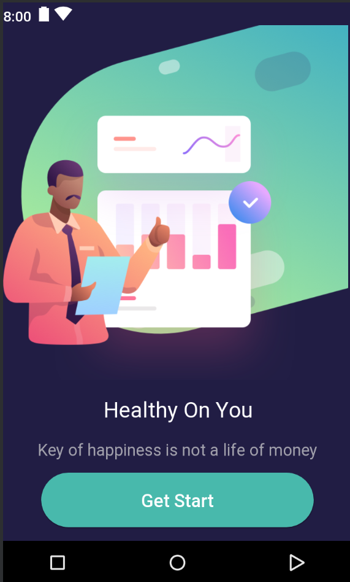
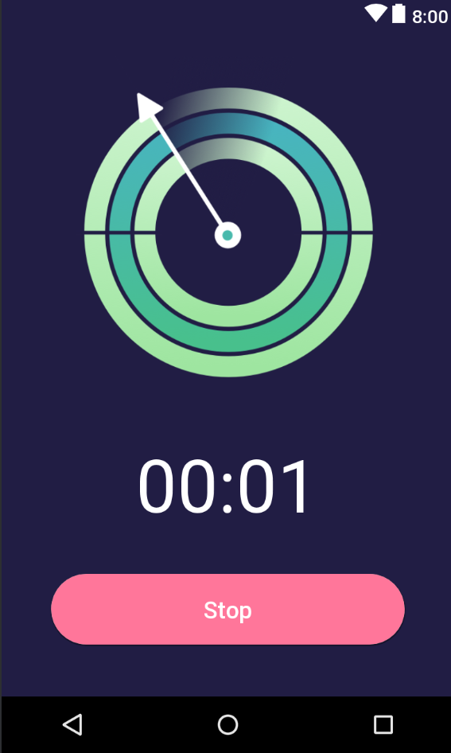

<h2 align="center">Android Learning 📱 :fire:</h2>

A Collection of projects & UI/UX Samples was written :computer: in my learning 📖 process.
.

  
  

### Projects
* [StopWatch ⌚️](StopWatch)
* [Gallery](Gallery)
* ..and more

### Screenshoots (Sample)
* StopWatch

Main App               | Start Stop Watch
:---------------------:|:------------------:
 | 

### How to use 🔌
1. Press the **Fork** button (top right the page) to save copy of this project on your account.

2. Download the repository files (project) from the download section or clone this project by typing in the bash the following command:

       git clone https://github.com/HouariZegai/AndroidProjects.git
3. Open any project folder in Android Studio, and done! 😃
